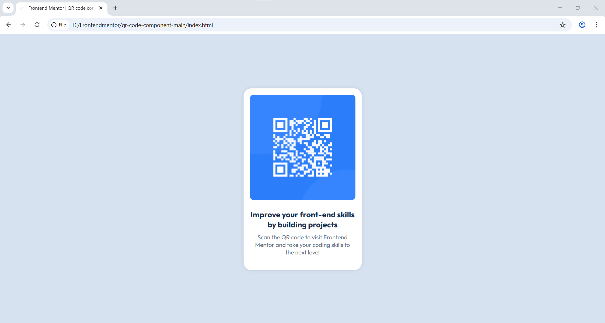

# Frontend Mentor - QR code component solution

This is a solution to the [QR code component challenge on Frontend Mentor](https://www.frontendmentor.io/challenges/qr-code-component-iux_sIO_H). Frontend Mentor challenges help you improve your coding skills by building realistic projects.

## Table of contents

- [Overview](#overview)
- [Screenshot](#screenshot)
- [Links](#links)
- [My Process](#my-process)
- [Built With](#built-with)
- [What I Learned](#what-i-learned)
- [Author](#author)

---

## 📌 Overview

This project displays a simple QR code component card with a title and description.  
The goal was to practice and develop my HTML and CSS skills.  
It helped me improve my understanding of layout and centering using Flexbox, as well as using semantic HTML tags effectively.

---

## 🖼️ Screenshot



---

## 🔗 Links

- **Solution URL:** [Add your solution URL here](https://your-solution-url.com)
- **Live Site URL:** [Add your live site URL here](https://your-live-site-url.com)

---

## 🛠️ My Process

I started by structuring the HTML, then styled the component using Flexbox.  
The most challenging part was starting this project, as it was my first real challenge.

---

## 🧱 Built With

- Semantic HTML5 markup  
- CSS custom properties  
- Flexbox  
- Desktop-first workflow  

---

## 📘 What I Learned

I learned how to use `min-height` in CSS to make sure the layout takes full screen height:

```css
body {
  min-height: 100vh;
}
